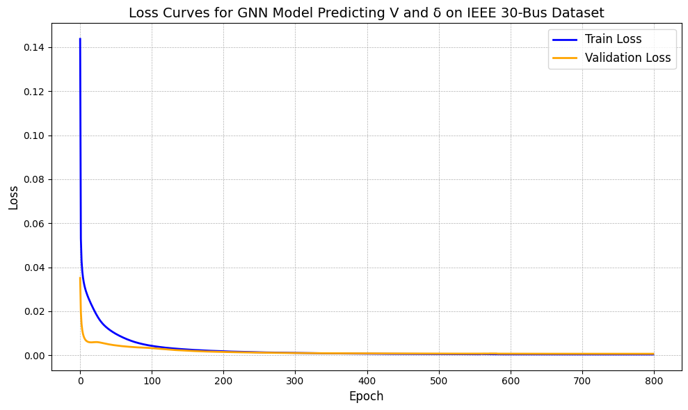
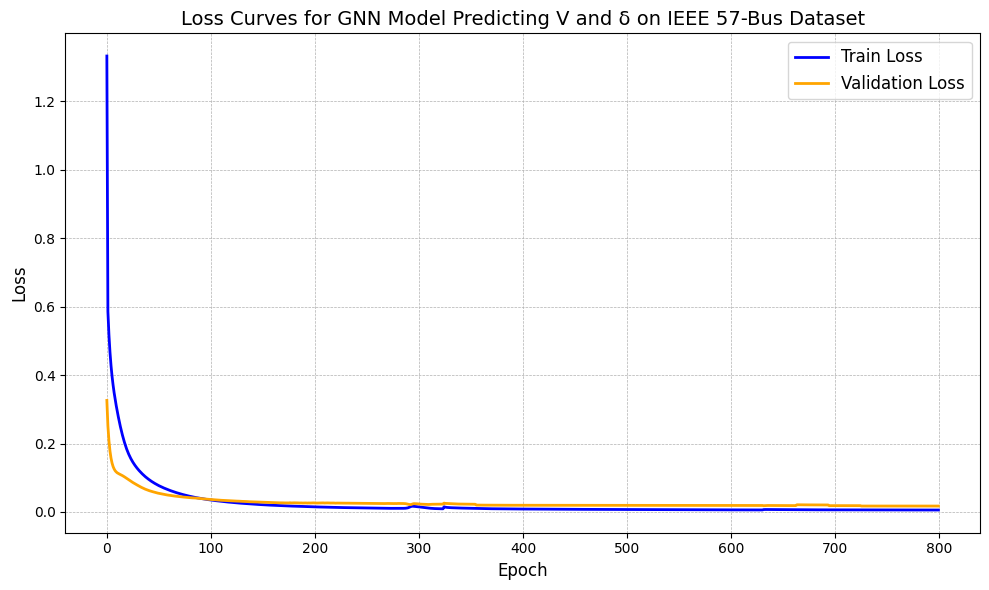

# GNN-OptimalPowerFlow

## Overview

This repository contains the implementation of **Graph Neural Networks (GNNs)** for efficient prediction of **Optimal Power Flow (OPF)** solutions in power systems. The project explores multiple GNN architectures (GCN, GAT, SAGEConv) for modeling power grids using IEEE standard test systems (14-bus, 30-bus, 57-bus, and 118-bus configurations).

The main goal of this project is to leverage GNNs to predict AC power flow variables (voltage magnitude and phase angle) efficiently, reducing computation time compared to traditional OPF solvers like Newton-Raphson and IPOPT.

## Key Features

- **Comprehensive GNN Models**: Includes implementations of GCN, GAT, and SAGEConv architectures using PyTorch Geometric.
- **Standard IEEE Test Systems**: Supports datasets for IEEE 14-bus, 30-bus, 57-bus, and 118-bus configurations with realistic load variations.
- **Pandapower Integration**: Utilizes Pandapower for dataset generation and AC power flow simulations, allowing accurate ground truth data with the Newton-Raphson method for training and evaluation.
- **Scalable and Efficient**: Demonstrates improved scalability and efficiency for large power systems using graph-based learning methods.

## Datasets

The datasets were generated using Pandapower with realistic load variations to simulate both daily and seasonal demand patterns. Each dataset consists of:
- Input features: Active power (P), Reactive power (Q), Voltage magnitude (V), and Voltage angle (δ).
- Output targets: Predicted Voltage magnitude (V) and Voltage angle (δ).

The data is saved in Excel format (`.xlsx`), with separate files for each dataset and bus configuration.

## Methodology

1. **Dataset Generation**:
   - Uses Pandapower to generate load flow datasets with random variations in load demands.
   - Solves AC power flow equations using the Newton-Raphson method for ground truth data.
   - Each dataset contains 2000 samples with realistic load variations for training, validation, and testing.

2. **GNN Architectures**:
   - **GCN**: A simple graph convolutional network for baseline performance.
   - **GAT**: Incorporates attention mechanisms to prioritize influential nodes (e.g., generator buses).
   - **SAGEConv**: Designed for inductive learning and scalability to larger grids.

3. **Training and Evaluation**:
   - Uses PyTorch Geometric for model implementation and training.
   - Evaluates the models based on Mean Squared Error (MSE), Normalized Root Mean Squared Error (NRMSE), and \( R^2 \) scores.
   - Compares GNN models against traditional OPF solvers for performance benchmarking.

## Installation

### Prerequisites

- Python 3.8 or higher
- Pandapower
- PyTorch
- PyTorch Geometric
- Matplotlib
- Pandas

    Simply follow the steps provided in the GNNPowerFlow.ipynb :)

## Usage

### Dataset Generation

Run the dataset generation script for the IEEE 14-bus, 30-bus or 57-bus system from the Dataset generation code.

This will generate 10 Excel files containing load flow data for training and testing.

### Evaluation

Evaluate the trained model and visualize the results:

## Results

The performance of the GNN architectures (GCN, GAT, and SAGEConv) was evaluated on the IEEE 14-bus, 30-bus, and 57-bus test systems. The metrics used for evaluation include:

The performance of each GNN architecture was evaluated using the following metrics:
- **Normalized Root Mean Squared Error (NRMSE)**: Consistently below 0.05 for all models across different bus systems.
- **\( R^2 \) Score**: High \( R^2 \) scores indicate strong predictive performance, especially for the GAT and SAGEConv models.
- **Average Test Loss**: Lower average test loss for SAGEConv, indicating strong generalization and scalability.

### Training and Validation Loss Curves

The following figures show the training and validation loss curves for the GAT model on IEEE 14-bus, 30-bus and 57-bus systems:

- **Training and Validation Loss (30-Bus GAT Model)**

  

- **Training and Validation Loss (57-Bus GAT Model)**

  

*The loss curves demonstrate effective convergence for all the cases. The validation loss closely follows the training loss, indicating good generalization and minimal overfitting.*

### Comparison of GNN Architectures:

1. **Validation NRMSE for Different GNN Architectures**:
   - GCN exhibited the highest NRMSE, particularly for larger systems (e.g., IEEE 57-bus), while SAGEConv consistently achieved the lowest NRMSE values across all configurations.
   - 

2. **Comparison of \( R^2 \) Scores**:
   - GAT and SAGEConv models demonstrated strong predictive performance, as reflected by higher \( R^2 \) scores, indicating a better fit to the true voltage values.
   - 

3. **Average Test Loss Across GNN Models**:
   - The average test loss was lowest for SAGEConv, showing its superior generalization ability compared to GCN and GAT, especially on larger bus systems.
   - 

| Model     | NRMSE (30-bus) | \( R^2 \) Score (30-bus) | Average Test Loss |
|-----------|----------------|--------------------------|-------------------|
| GCN       | 0.042          | 0.92                     | 0.015             |
| GAT       | 0.025          | 0.97                     | 0.008             |
| SAGEConv  | 0.018          | 0.98                     | 0.005             |

Training and evaluation results, including loss curves and performance metrics, are available in the `results/` folder.

### Summary:

The results demonstrate the strengths of different GNN architectures:
- **GCN**: Performs adequately on smaller systems but struggles with larger configurations due to limited feature propagation capability.
- **GAT**: Shows improved performance with its attention mechanism, prioritizing influential nodes (e.g., generator buses).
- **SAGEConv**: Exhibits the best overall performance, with lower NRMSE, higher \( R^2 \) scores, and reduced test loss, making it suitable for both small and large power grid configurations.

## Contributing

Feel free to submit issues or pull requests if you have suggestions or improvements.

## Acknowledgments

Special thanks to Dr. Kaixiong Zhou as this was a project of ECE592: Advanced Topic in Deep Learning at NCSU under his supervision.
